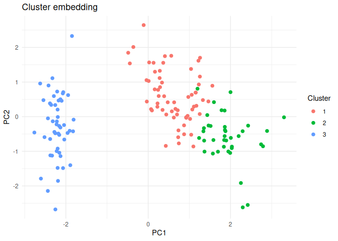
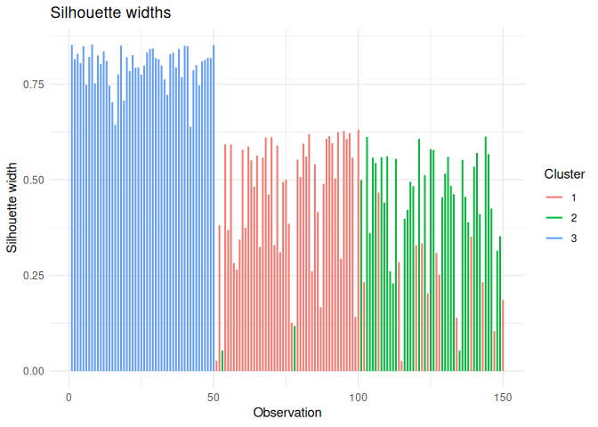
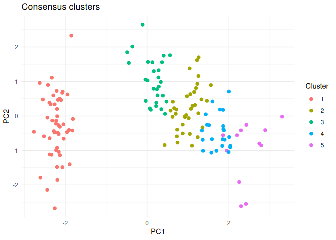
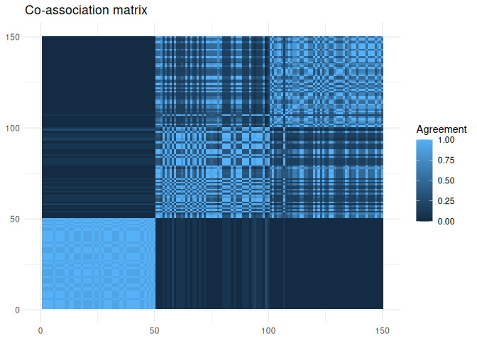
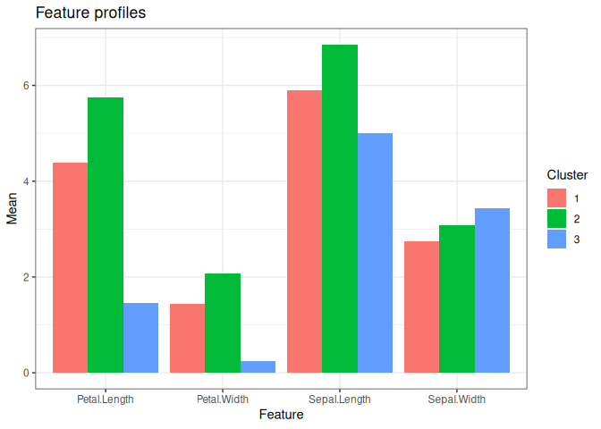
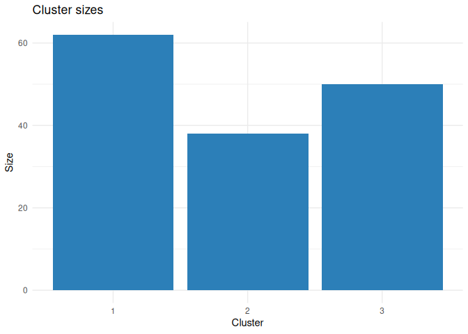
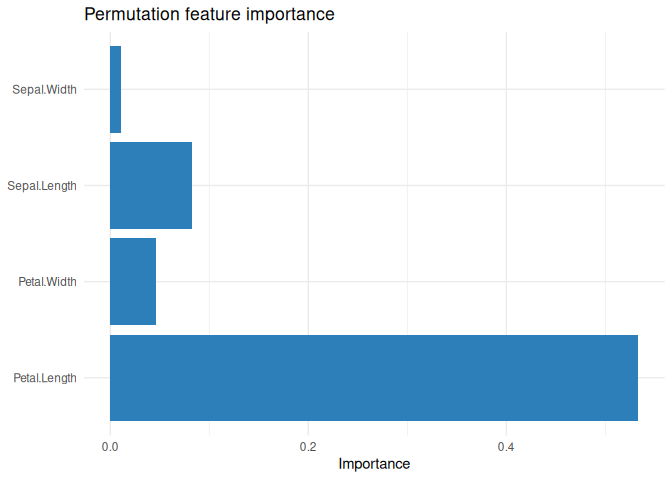
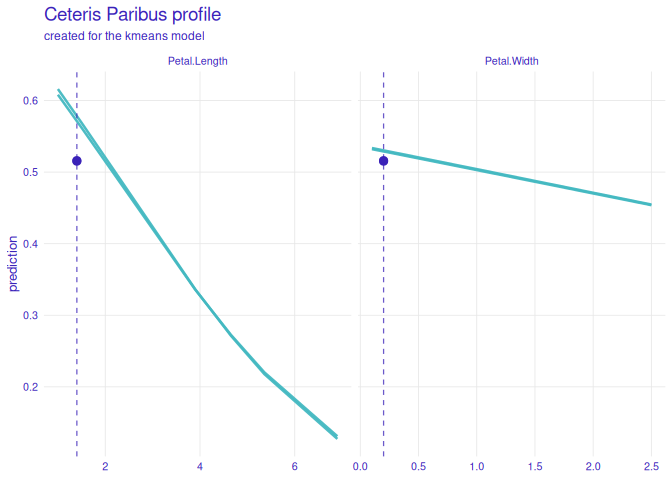
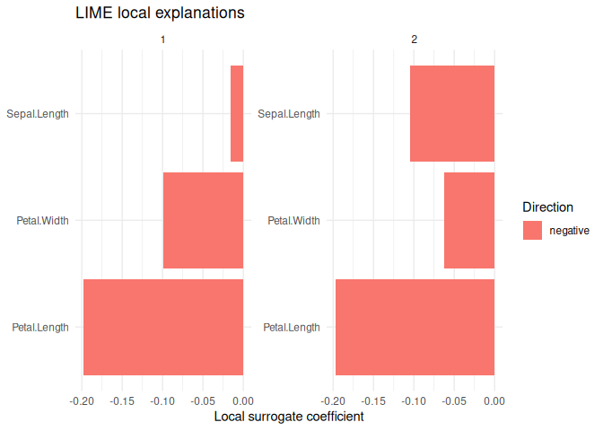

phynotype
================

`phynotype` is an R package for clustering workflows, consensus
meta-clustering, validation, exploration, prediction, and plotting.

`phynotype` is a clustering workflow package. It is not a phenotypic
data processing package.

## Installation

`phynotype` is not on CRAN yet. Install the development version from
GitHub:

``` r
# install.packages("pak")
pak::pkg_install("ielbadisy/phynotype")
```

Or install from a local source checkout:

``` r
pak::pkg_install("path/to/phynotype")
```

## Quick start

``` r
library(phynotype)

fit <- cluster(iris[, 1:4], method = "kmeans", k = 3, seed = 1)
fit
#> <cluster_fit>
#>   Method: kmeans
#>   Observations: 150
#>   Clusters: 3
summary(fit)
#> Cluster fit summary
#>   Method: kmeans
#>   Observations: 150
#>   Clusters: 3
#>   Sizes: 1=62, 2=38, 3=50
```

## API accessors

The main objects expose a common accessor API, so downstream code does
not need to inspect object internals.

``` r
method_used(fit)
#> [1] "kmeans"
n_clusters(fit)
#> [1] 3
data.frame(cluster = names(sizes(fit)), size = unname(sizes(fit)))
#>   cluster size
#> 1       1   62
#> 2       2   38
#> 3       3   50
head(clusters(fit))
#> [1] 3 3 3 3 3 3
centers(fit)
#>   Sepal.Length Sepal.Width Petal.Length Petal.Width
#> 1   0.05827957 -0.30894624    0.6355484   0.2345376
#> 2   1.00666667  0.01635088    1.9841053   0.8717193
#> 3  -0.83733333  0.37066667   -2.2960000  -0.9533333
```

## Meta-clustering

``` r
mfit <- metacluster(
  iris[, 1:4],
  methods = c("kmeans", "pam", "hclust"),
  k = 2:5,
  consensus = "coassoc",
  seed = 1
)

mfit
#> <metacluster_fit>
#>   Methods: kmeans, pam, hclust
#>   Candidate fits: 12
#>   Final clusters: 5
summary(mfit)
#> Meta-cluster summary
#>   Methods: kmeans, pam, hclust
#>   Candidate fits: 12
#>   Final clusters: 5
#>   Sizes: 1=50, 2=37, 3=28, 4=23, 5=12
```

Inspect the candidate solutions, consensus selection, and co-association
matrix:

``` r
head(mfit$candidate_table)
#>   candidate method k n_clusters
#> 1         1 kmeans 2          2
#> 2         2 kmeans 3          3
#> 3         3 kmeans 4          4
#> 4         4 kmeans 5          5
#> 5         5    pam 2          2
#> 6         6    pam 3          3
mfit$selection_summary
#>   k silhouette
#> 1 2  0.6566933
#> 2 3  0.7658527
#> 3 4  0.8603009
#> 4 5  0.9076378
mfit$stability_summary
#>                         metric mean_agreement min_agreement max_agreement
#> 1 pairwise_partition_agreement      0.8186128     0.6760889             1
round(mfit$coassoc_matrix[1:6, 1:6], 2)
#>      [,1] [,2] [,3] [,4] [,5] [,6]
#> [1,] 1.00 1.00 1.00 1.00 1.00 0.92
#> [2,] 1.00 1.00 1.00 1.00 1.00 0.92
#> [3,] 1.00 1.00 1.00 1.00 1.00 0.92
#> [4,] 1.00 1.00 1.00 1.00 1.00 0.92
#> [5,] 1.00 1.00 1.00 1.00 1.00 0.92
#> [6,] 0.92 0.92 0.92 0.92 0.92 1.00
```

## Validation

``` r
validate(fit)
#> <cluster_validation>
#>   Object type: cluster_fit
#>   Metrics: 5
#>             metric       value               scale        direction
#>         silhouette   0.5528190             -1 to 1 higher is better
#>  calinski_harabasz 561.6277566 positive, unbounded higher is better
#>     davies_bouldin   0.6619715 positive, unbounded  lower is better
#>       total_within  78.8514414 positive, unbounded  lower is better
#>      bootstrap_ari   0.9710021                <NA>             <NA>
validate(mfit)
#> <cluster_validation>
#>   Object type: metacluster_fit
#>   Metrics: 4
#>                        metric       value               scale        direction
#>                    silhouette   0.4925619             -1 to 1 higher is better
#>             calinski_harabasz 494.0510734 positive, unbounded higher is better
#>                davies_bouldin   0.8168048 positive, unbounded  lower is better
#>  pairwise_partition_agreement   0.8186128                <NA>             <NA>
validate(iris[, 1:4], method = "kmeans", k = 2:6, seed = 1)
#> <cluster_validation>
#>   Object type: validation_grid
#>   Metrics: 25
#>             metric       value               scale        direction k
#>         silhouette   0.6810462             -1 to 1 higher is better 2
#>  calinski_harabasz 513.9245460 positive, unbounded higher is better 2
#>     davies_bouldin   0.4042928 positive, unbounded  lower is better 2
#>       total_within 152.3479518 positive, unbounded  lower is better 2
#>      bootstrap_ari   0.9973179                <NA>             <NA> 2
#>         silhouette   0.5528190             -1 to 1 higher is better 3
#>  calinski_harabasz 561.6277566 positive, unbounded higher is better 3
#>     davies_bouldin   0.6619715 positive, unbounded  lower is better 3
#>       total_within  78.8514414 positive, unbounded  lower is better 3
#>      bootstrap_ari   0.9710021                <NA>             <NA> 3
#>         silhouette   0.4980505             -1 to 1 higher is better 4
#>  calinski_harabasz 530.7658082 positive, unbounded higher is better 4
#>     davies_bouldin   0.7803070 positive, unbounded  lower is better 4
#>       total_within  57.2284732 positive, unbounded  lower is better 4
#>      bootstrap_ari   0.9052257                <NA>             <NA> 4
#>         silhouette   0.4912400             -1 to 1 higher is better 5
#>  calinski_harabasz 495.3699060 positive, unbounded higher is better 5
#>     davies_bouldin   0.8159888 positive, unbounded  lower is better 5
#>       total_within  46.4611727 positive, unbounded  lower is better 5
#>      bootstrap_ari   0.9218582                <NA>             <NA> 5
#>         silhouette   0.3648340             -1 to 1 higher is better 6
#>  calinski_harabasz 473.8506068 positive, unbounded higher is better 6
#>     davies_bouldin   0.9141580 positive, unbounded  lower is better 6
#>       total_within  39.0399872 positive, unbounded  lower is better 6
#>      bootstrap_ari   0.8684184                <NA>             <NA> 6
```

## Exploration

``` r
exp <- explore(fit)
exp
#> <cluster_explore>
#>   Rows in feature summary: 12
head(exp$feature_summary)
#>   cluster      feature     mean        sd median min max
#> 1       1 Sepal.Length 5.901613 0.4664101    5.9 4.9 7.0
#> 2       1  Sepal.Width 2.748387 0.2962841    2.8 2.0 3.4
#> 3       1 Petal.Length 4.393548 0.5088950    4.5 3.0 5.1
#> 4       1  Petal.Width 1.433871 0.2974997    1.4 1.0 2.4
#> 5       2 Sepal.Length 6.850000 0.4941550    6.7 6.1 7.9
#> 6       2  Sepal.Width 3.073684 0.2900924    3.0 2.5 3.8
```

## Plotting

``` r
plot_clusters(fit)
```

<!-- -->

``` r
plot_silhouette(fit)
```

<!-- -->

``` r
plot_consensus(mfit)
```

<!-- -->

``` r
plot_coassoc(mfit)
```

<!-- -->

``` r
plot_feature_profiles(explore(fit))
```

<!-- -->

``` r
plot_cluster_sizes(fit)
```

<!-- -->

## Prediction

``` r
pred <- predict(fit, iris[1:10, 1:4])
pred
#> <cluster_prediction>
#>   Method: kmeans
#>   Predictions: 10
data.frame(
  observation = seq_along(pred$clusters),
  cluster = pred$clusters
)
#>    observation cluster
#> 1            1       3
#> 2            2       3
#> 3            3       3
#> 4            4       3
#> 5            5       3
#> 6            6       3
#> 7            7       3
#> 8            8       3
#> 9            9       3
#> 10          10       3
```

## Interpretability

Global permutation importance estimates which features the fitted
clustering rule relies on most.

``` r
imp <- feature_importance(fit, n_repeats = 3, seed = 1)
imp
#> <feature_importance>
#>   Metric: instability
#>   Features: 4
#>   Repeats: 3
imp$summary
#>        feature importance   std_error n_repeats
#> 1 Petal.Length 0.53333333 0.007698004         3
#> 2 Sepal.Length 0.08222222 0.005879447         3
#> 3  Petal.Width 0.04666667 0.013877773         3
#> 4  Sepal.Width 0.01111111 0.005879447         3
```

``` r
plot(imp)
```

<!-- -->

Ceteris paribus profiles show how local predictions change when one
feature is varied and the other features are held fixed.

``` r
cp <- ceteris_paribus(
  fit,
  iris[1:2, 1:4],
  features = c("Petal.Length", "Petal.Width"),
  grid_size = 6,
  target = "score"
)

cp
#> <ceteris_paribus>
#>   Target: score
#>   Profiles: 24
head(cp$profiles)
#>   observation      feature feature_value target cluster     value
#> 1           1 Petal.Length      1.000000  score       3 0.6159904
#> 2           1 Petal.Length      1.500000  score       3 0.5688455
#> 3           1 Petal.Length      3.900000  score       3 0.3362419
#> 4           1 Petal.Length      4.653333  score       3 0.2714101
#> 5           1 Petal.Length      5.360000  score       3 0.2177254
#> 6           1 Petal.Length      6.900000  score       3 0.1273152
#>   observed_value baseline_value baseline_cluster
#> 1            1.4      0.5160253                3
#> 2            1.4      0.5160253                3
#> 3            1.4      0.5160253                3
#> 4            1.4      0.5160253                3
#> 5            1.4      0.5160253                3
#> 6            1.4      0.5160253                3
```

``` r
plot(cp)
```

<!-- -->

LIME-style explanations fit local surrogate models around selected
observations.

``` r
lx <- lime_explain(
  fit,
  iris[1:2, 1:4],
  n_features = 3,
  n_permutations = 50,
  seed = 1
)

lx
#> <lime_explanation>
#>   Target: cluster
#>   Observations: 2
#>   Effects: 6
lx$explanations
#>   observation cluster  target      feature    estimate absolute_effect
#> 1           1       3 cluster Petal.Length -0.19822343      0.19822343
#> 2           1       3 cluster  Petal.Width -0.09873821      0.09873821
#> 3           1       3 cluster Sepal.Length -0.01557945      0.01557945
#> 4           2       3 cluster Petal.Length -0.19694373      0.19694373
#> 5           2       3 cluster Sepal.Length -0.10438655      0.10438655
#> 6           2       3 cluster  Petal.Width -0.06264646      0.06264646
#>   direction rank
#> 1  negative    1
#> 2  negative    2
#> 3  negative    3
#> 4  negative    1
#> 5  negative    2
#> 6  negative    3
```

``` r
plot(lx)
```

<!-- -->
